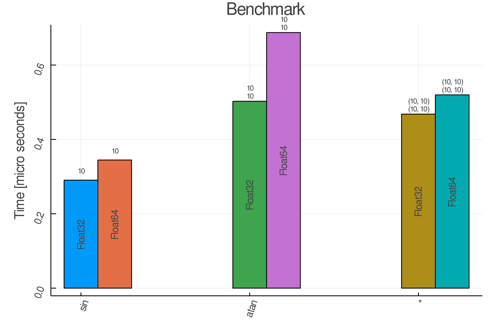
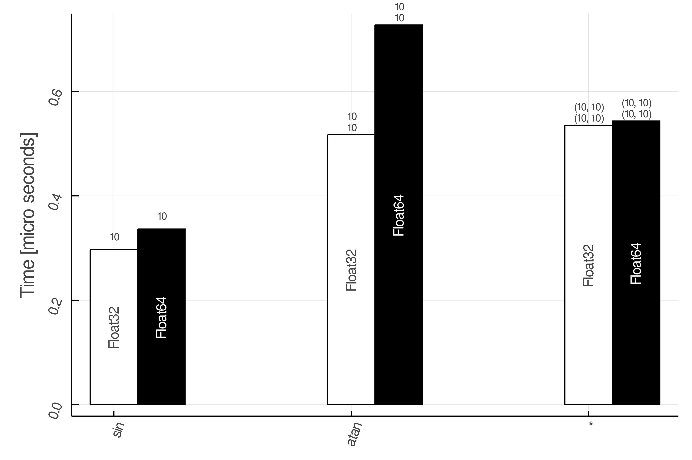

# AcuteBenchmark

[](https://aminya.github.io/AcuteBenchmark.jl/dev)
[](https://travis-ci.com/aminya/AcuteBenchmark.jl)
[](https://ci.appveyor.com/project/aminya/AcuteBenchmark-jl)


AcuteBenchmark allows you to benchmark functions that get Arrays as their input.

Creates random inputs for a function based on limits, types, and dims specified.
```julia
config = Funb(
    fun = sin,
    limits = [(-1,1)],
    types = [Float32, Float64],
    dims = [100],
)
```
or just in a compact form:
```julia
config = Funb( sin, [(-1,1)], [Float32, Float64], [10])
```

use benchmark! to run the benchmark:
```julia
using AcuteBenchmark

configs = FunbArray([
    Funb( sin, [(-1,1)],[Float32, Float64], [10] );
    Funb( atan, [(-1,1), (-1,1)],[Float32, Float64],[10, 10] );
    Funb( *, [(-1, 1), (-1, 1), (-1, 1)], [Float32, Float64], [(10,10), (10,10)] );
    ])

benchmark!(configs)
```

Plot the benchmark result using:
```julia
bardim(configs)
```


To have a same color for the same types use:
```julia
bardim(configs, true)
```


